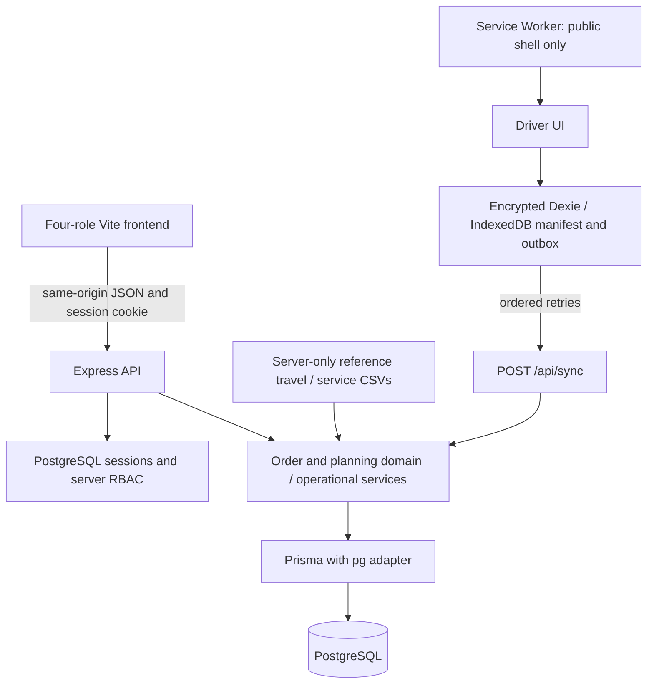

# Architecture

The shipped application uses vanilla JavaScript/HTML/CSS built by Vite, Express 5 on Node 24, Prisma 7 with the PostgreSQL adapter, and PostgreSQL. It uses no Redis, message broker or separate frontend server in production.

Express serves an explicit allowlist of built HTML, scripts, styles and the generated Service Worker. Repository files, data CSVs, Prisma files, environment files, source maps and arbitrary paths are not static resources. API responses use no-store. Health checks separate liveness (`/api/health`) from database/schema readiness (`/api/ready`).

Authentication uses salted bcrypt hashes, a regenerated server session on login, HttpOnly/SameSite=Lax cookies, and a stable secret. HTTPS deployment uses Secure cookies and explicitly trusted proxy configuration. Local Compose binds loopback and opts out of Secure cookies only for HTTP preview. Role and outlet/depot/Driver scopes come from the authenticated database user. Same-origin mutation checks reject cross-origin browser requests; strict route schemas reject invalid payloads. Logout destroys the session.

Order policy owns carton validation, the 16:00 Asia/Colombo cutoff and operating-date checks. Planning loads persisted orders, fleet and weekly reservations, then calls the pure shared constraint engine. Draft edits and release revalidate inputs under a shared PostgreSQL advisory lock; release is atomic. District travel/service references are server-only files selected as a consistent dataset. The judge image includes exact supplied operational references with a SHA-256 manifest. Seed refuses mismatched existing reference values.

`apps/api/src/operations.js` owns loading, shortfalls, arrival, delivery exceptions, POD, receipt and lifecycle transactions. The online routes and sync endpoint reuse it. Composite allocation foreign keys preserve order/outlet/stop/trip integrity; unique proofs, receipts and sync action IDs prevent duplicate completion. SQL triggers retain order status history. Released manifests feed Loader and assigned Driver projections.

The build hashes public shell resources into a Service Worker cache version. No auth endpoint or arbitrary API response is cached by the worker. The Driver saves authorized manifests plus ordered pending actions in encrypted IndexedDB. A same-Driver unlock grant supports an eight-hour offline authorization window. Arrival/POD/exception/reattempt remain provisional until acknowledged by `/api/sync`; ownership, manifest version, payload and lifecycle are checked again. Conflicts retain the outbox and show Needs attention. Re-authentication can unlock only the original account's work. Sign-out with pending work is blocked; explicit successful sign-out removes the working cache/grant. Storage eviction and compromised-device risks remain documented limitations.

Compose has `app` and `postgres` services. PostgreSQL readiness gates application bootstrap; startup deploys versioned migrations, optionally runs the create-once judge seed, then starts Express in production mode as the `node` user. Failures stop startup. The final image includes the required server-only reference CSVs and excludes unrelated datasets, host dependencies, browser profiles, docs, tests and secrets. Prisma CLI remains a runtime dependency to apply migrations. Frontend build tooling is pruned from the final dependency tree.

No optimization solver, live traffic feed, inventory integration, automatic Driver assignment administration or background sync service is claimed. The separate product-page workspace is not part of the operational deployment.

## Submission readiness additions

The server catalogue owns product codes, carton specifications and ambient/chilled/frozen requirements. Order context supplies the catalogue to the Store UI; forged specifications and temperature mismatches are rejected.

Explicit judge mode configures the production startup ordering clock inside supplied calendar coverage and discloses it through authenticated scenario/context endpoints and a UI banner. It refuses databases with non-demo accounts. Session expiry, security settings and delivery timestamps use real time. Real operations use RELAY_JUDGE_MODE=false.

Planning exposes calendar context and applies a documented conservative 20% monsoon travel allowance. Demand event flags inform Dispatcher review; actual orders drive capacity. Deferred carry-forward, draft edits, allocation and release share the planning advisory lock. Carry-forward requires a later operating date and current order version; it preserves the requested date and audit history. Release requires an active Driver on every draft.
