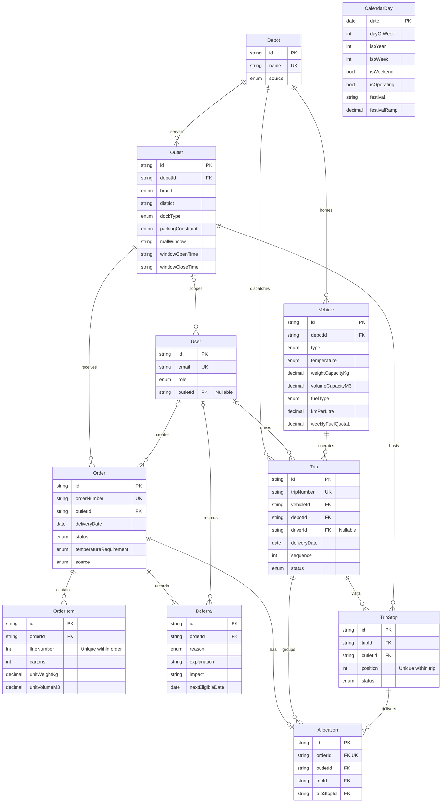
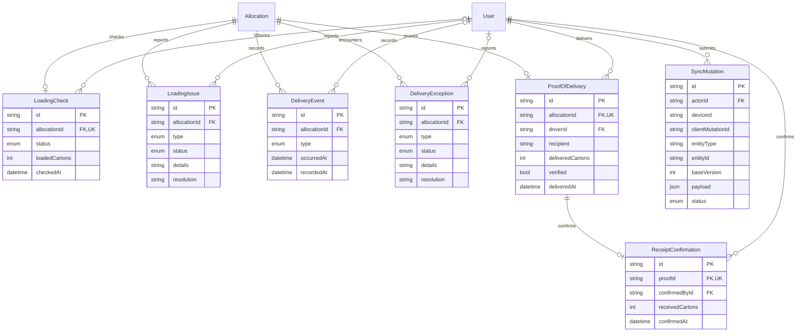

# Relay data model — Stage 2

The source of truth is `prisma/schema.prisma` plus the SQL check constraints in `prisma/migrations/20261001000200_domain_checks/migration.sql`. This is the persisted domain foundation; the current UI still uses its original localStorage prototype state.

## Network and planning

`CalendarDay` intentionally has no date foreign keys: future orders may be scheduled beyond an imported calendar. The seed explicitly requires its demonstration date to be an operating day in the supplied calendar. Depot names are derived from the union of referenced supplied depot names and checked for agreement between the two network files; no depot locations or coordinates are invented.

## Loading, delivery, receipt and future audit

Diagrams show actual foreign-key cardinality. An order can currently exist without items at the database level; a later order-creation service must enforce at least one item atomically. The audit target `(entityType, entityId)` is polymorphic metadata, not a foreign key or functioning sync engine.

## Identity and invariants

- Orders have independent IDs and unique order numbers. `(outletId, deliveryDate)` is indexed, **not unique**; the seed contains multiple Fresh orders for one outlet/day.
- Trip `(vehicleId, deliveryDate, sequence)` and stop `(tripId, position)` are unique. A stop can deliver multiple orders for its outlet.
- An allocation is the current assignment for one order. Composite foreign keys ensure its order and stop share the same outlet, and its stop belongs to its trip. Later allocation services must handle reassignment/history without rewriting completed delivery evidence.
- Proof and receipt are separate, optional one-to-one records. Deferrals, issues, exceptions and events preserve multiple records. Foreign keys use `RESTRICT` deletion so deleting a parent cannot silently remove delivery evidence.
- Decimal quantities retain capacities and fuel values without floating-point rounding. SQL checks reject nonpositive capacities/items, invalid daily windows, invalid stop/trip positions and negative sync versions. Complete POD quantity verification, role authorization, vehicle/depot compatibility, trip date matching, route feasibility and state transitions are later service responsibilities, not claims made by this schema.
- All event/audit timestamps use PostgreSQL `timestamptz(6)`. Delivery dates use `date`; `HH:mm` windows are local operational times in `Asia/Colombo`. No overnight window is inferred from supplied data. Seed instants include an explicit `+05:30` offset.
- `SUPPLIED` identifies official network/calendar records, `DEMO` identifies Relay-created transactions/users and `APPLICATION` is the future operational default. Demo users have no passwords or authentication mechanism.

## Status vocabulary

| Entity | Values |
| --- | --- |
| Order | `CONFIRMED`, `PLANNED`, `DEFERRED`, `RELEASED`, `IN_DELIVERY`, `DELIVERED`, `RECEIVED`, `CANCELLED` |
| Trip | `DRAFT`, `RELEASED`, `LOADING`, `READY`, `IN_PROGRESS`, `COMPLETED`, `CANCELLED` |
| Stop | `PENDING`, `ARRIVED`, `COMPLETED`, `DEFERRED` |
| Loading check | `PENDING`, `LOADED`, `ISSUE` |
| Issue/exception | `OPEN`, `RESOLVED` |
| Sync mutation | `PENDING`, `APPLIED`, `REJECTED`, `CONFLICT` |

JavaScript constants are centralized in `packages/domain/src/index.js`; tests enforce exact agreement with all Prisma enums. Existing prototype UI labels are deliberately unchanged. `CONFIRMED` corresponds to a submitted order awaiting planning; `IN_DELIVERY` corresponds to the current UI's “In transit”; `RECEIVED` records the Store confirmation after delivery. This stage does not enforce or expose status-transition APIs.
