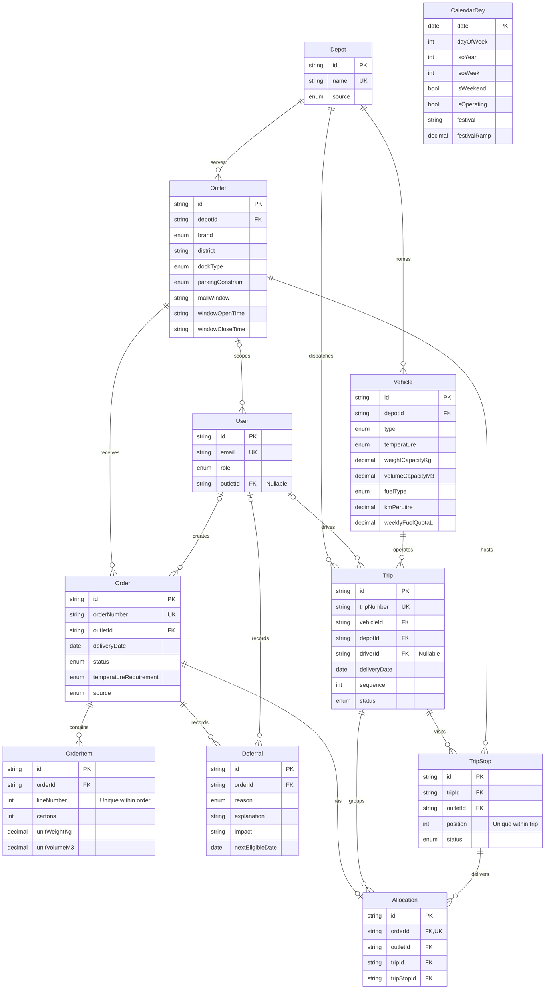
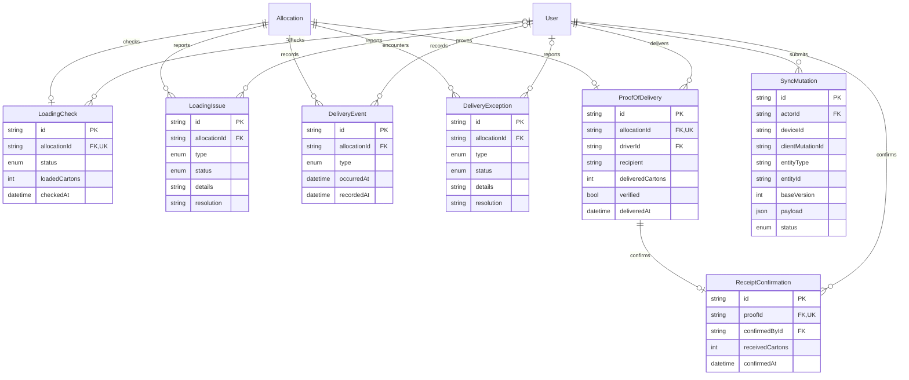

# Relay data model — final implementation

The source of truth is `prisma/schema.prisma` plus the SQL check constraints in `prisma/migrations/20261001000200_domain_checks/migration.sql`. The current four-role application uses these persisted records through scoped APIs.

## Network and planning

`CalendarDay` has no date foreign keys at the database level. The order-creation service requires an imported operating day; ordering beyond the current calendar requires importing later authorized dates first. The seed explicitly requires its demonstration date to be an operating day in the supplied calendar. Depot names are derived from the union of referenced supplied depot names and checked for agreement between the two network files; no depot locations or coordinates are invented.

## Loading, delivery, receipt and synchronization audit

Diagrams show actual foreign-key cardinality. An order can currently exist without items at the database level; the order-creation service enforces at least one item atomically. The audit target `(entityType, entityId)` is polymorphic metadata, not a foreign key; the implemented sync service validates and applies these records.

## Identity and invariants

- Orders have independent IDs and unique order numbers. `(outletId, deliveryDate)` is indexed, **not unique**; the seed contains multiple Fresh orders for one outlet/day.
- Trip `(vehicleId, deliveryDate, sequence)` and stop `(tripId, position)` are unique. A stop can deliver multiple orders for its outlet.
- An allocation is the current assignment for one order. Composite foreign keys ensure its order and stop share the same outlet, and its stop belongs to its trip. The planning service preserves allocation identity during draft review and refuses editing released trips.
- Proof and receipt are separate, optional one-to-one records. Deferrals, issues, exceptions and events preserve multiple records. Foreign keys use `RESTRICT` deletion so deleting a parent cannot silently remove delivery evidence.
- Decimal quantities retain capacities and fuel values without floating-point rounding. SQL checks reject nonpositive capacities/items, invalid daily windows, invalid stop/trip positions and negative sync versions. Complete POD quantity verification, role authorization, vehicle/depot compatibility, trip date matching, route feasibility and state transitions are enforced by the current domain and operational services in addition to these database invariants.
- All event/audit timestamps use PostgreSQL `timestamptz(6)`. Delivery dates use `date`; `HH:mm` windows are local operational times in `Asia/Colombo`. No overnight window is inferred from supplied data. Seed instants include an explicit `+05:30` offset.
- `SUPPLIED` identifies imported network/calendar records (public synthetic judge references by default, authorized official data when configured); `DEMO` identifies seeded transactions/users and `APPLICATION` is the operational default. Users have independently salted bcrypt password hashes, active flags, role and optional outlet/depot scope. Seed reruns preserve existing hashes.

## Status vocabulary

| Entity | Values |
| --- | --- |
| Order | `CONFIRMED`, `PLANNED`, `DEFERRED`, `RELEASED`, `IN_DELIVERY`, `DELIVERED`, `RECEIVED`, `CANCELLED` |
| Trip | `DRAFT`, `RELEASED`, `LOADING`, `READY`, `IN_PROGRESS`, `COMPLETED`, `CANCELLED` |
| Stop | `PENDING`, `ARRIVED`, `COMPLETED`, `DEFERRED` |
| Loading check | `PENDING`, `LOADED`, `ISSUE` |
| Issue/exception | `OPEN`, `RESOLVED` |
| Sync mutation | `PENDING`, `APPLIED`, `REJECTED`, `CONFLICT` |

JavaScript constants are centralized in `packages/domain/src/index.js`; tests enforce exact agreement with all Prisma enums. Existing prototype UI labels are deliberately unchanged. `CONFIRMED` corresponds to a submitted order awaiting planning; `IN_DELIVERY` corresponds to the current UI's “In transit”; `RECEIVED` records the Store confirmation after delivery. The operational service enforces and exposes lifecycle transitions. Release changes the Trip to RELEASED; its orders remain PLANNED until Driver start moves them to IN_DELIVERY.

## Authentication, audit and reconciliation

`Session` is created by the authentication SQL migration and managed by connect-pg-simple, not a Prisma model. It stores the session ID, JSON session data (including userId) and expiry with an expiry index. Login regenerates the session; logout deletes it. User safe projections exclude passwordHash. User.depotId references Depot and scopes Loader access.

Migration/schema comparison excludes this deliberately SQL-managed Session table. OrderStatusEvent explicitly uses `onUpdate: NoAction` to match its historical SQL foreign key; Stage 9 corrected that schema annotation without rewriting migrations or changing the database.

`OrderStatusEvent` belongs to Order and is indexed by orderId/occurredAt. Database triggers create initial/status-change events. `Trip.planningContext` and `Deferral.planningContext` retain validation metrics, decisions, rejections and review/release actor/time. These fields are from the final planning migration.

LoadingCheck is unique per allocation with loadedCartons, actor and check time. LoadingIssue and DeliveryException retain type, OPEN/RESOLVED state, details, resolution and timestamps. DeliveryEvent separates client occurrence from recording time. ProofOfDelivery is unique per allocation; ReceiptConfirmation is unique per proof and records the receiving Store Manager/count.

SyncMutation has unique (deviceId, clientMutationId), actorId, entityType/entityId, operation, baseVersion, JSON payload, status, clientOccurredAt, receivedAt, appliedAt and errorCode. Online actions and offline sync use durable idempotency receipts in the operational transaction. Actor/payload/assignment checks precede replay acceptance. A repeated action cannot cross account boundaries. The polymorphic trip reference is validated in services rather than an FK. Client IndexedDB stores manifests and the outbox together in a per-Driver encrypted vault record, with the active offline-access grant in a separate store; these are not extra PostgreSQL tables.
